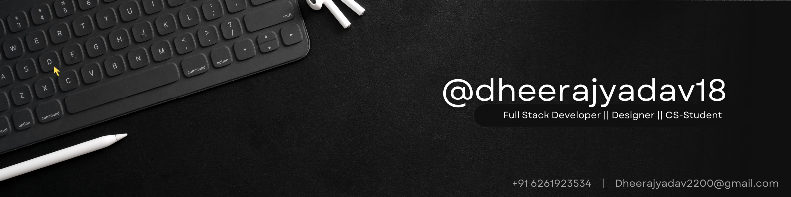

# [⚡Hey There, I'm Dheeraj Yadav!⚡](https://dheerajyadav18-portfolio-dheerajyadav18.vercel.app/)

</a>&nbsp;&nbsp;
</a>

 

 

### About Me 🚀
- 🎓 Student at Indore Institute Of Science & Technology.
- 🤞  Pursuing my Bachelors in Computer Science & Engineering.
- 👯 I'm looking to collaborate on Open source project
- 👨‍💻 All of my projects are available at https://dheerajyadav18-portfolio-dheerajyadav18.vercel.app/
- 💬 Ask me about **Web Development, UI/UX Design, Graphic Design.**
- 📫 How to reach me: <a href="mailto:dheerajyadav2200@gmail.com">dheerajyadav2200@gmail.com</a>
- 📄 Know about my experiences, my *Resume*: [here](https://drive.google.com/file/d/1_j2BLLQbJqfJB0OALNlL_ne3tEK48Mji/view)
- 🌱 Currently learning Data Structures and Algorithms and web development.
- 💻 Graphic Designer At Codechef IIST Chapter And UI/UX Designer at GDSC IIST

 

 <!---------------------------- My Skills Section ----------------------------->
## 📚 My Skills

 

</tr>

<!---------------------------- Github Statistics ----------------------------->
## 📊 Github Statistics

  
  

<!---------------------------------  Marquee Animation  ------------------------>

</table>
 

 

🧡 Please provide support by giving star if you liked it. 🧡 

